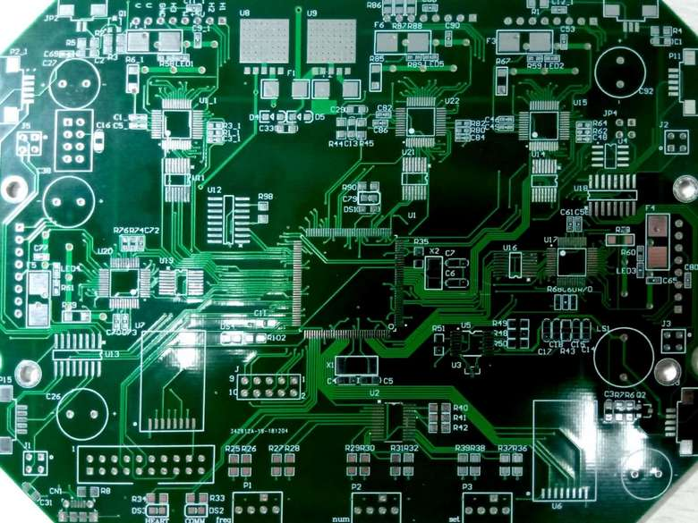
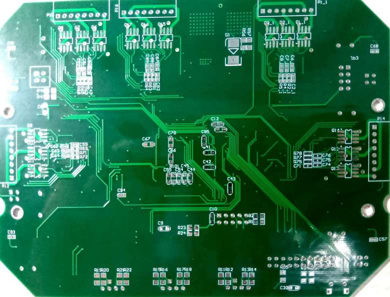
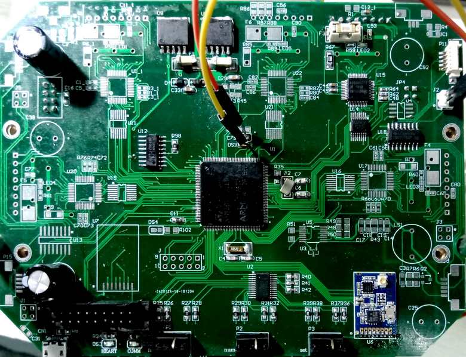

# Main_Board

ZJUNlict Main Board Design for the RoboCup Soccer Small-Size League https://zjunlict.cn/

The main board is designed to replace the [core board](https://github.com/ZJUNlict/Core_Board), [mother board](https://github.com/ZJUNlict/Mother_Board) and [motor driver board](https://github.com/ZJUNlict/Motor_Driver_Board) which is currently under testing. (The board is designed using [Altium Designer](https://www.altium.com/altium-designer/) 17.1)

**Sincere thanks for Team TIGERs Mannheim's [opensource electronics design](https://tigers-mannheim.de/index.php?id=65), which gives a mature seperate BLDC controller design with small footprint and relative low cost.**

Blank board photos are shown below.

The main features are:

* STM32H743ZIT6 as the main controller with frequency up to 400MHz.
* Two nRF24L01P modules operate in different frequency handles package receiving and transmitting.
* An IO expansion chip PCA9539 reads rotary DIP switchs.
* Five BLDC controller chips A3930 controls five motors.
* Differential receiver chip SN65LBC175 receives encoder signal.
* AD converter chip ADS112C04IPWR process the current signal from A3930.
* Interface to external gyroscope, accelerometer, compass and optic flow chips. (IIC and SPI)

The motor driver, encoder counter, UART, IIC and SPI communication functions have been tested. The testing board is shown in figure below.

